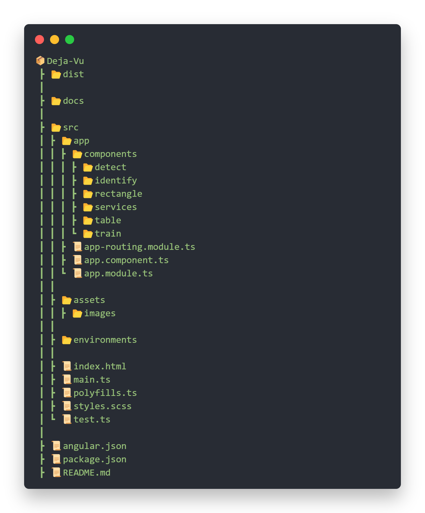

<h1 align="center">Deja-Vu</h1>

<p align="center">


</p>

<p>&nbsp;</p>
<p>&nbsp;</p>

---

# Overview

Deja-Vu is a client side application generated with [Angular CLI](https://github.com/angular/angular-cli) version 13. The core function of this application is to detect, recognize and analyze human faces by uploading images to the web application with the help of Microsoft's Face API; An AI service that analyzes faces in images. Face API's features include face detection that perceives facial features and attributes—such as a face mask, glasses, or face location—in an image, and identification of a person by a match to your private repository or via photo ID.

---

# Features and Capabilities

The application is capable of following functionalities, with room for improvement:

- **Detect:** Facial features and attributes of a single person can be detected by uploading an image.
- **Train:** A Person Group can be creaeted, withinn which, a Person can be created and his/her images can be trained.
- **Identify:** A person can be identified from a pre-existing and pre-trained Person Group.

*For more detail, please refer to [Azure Face API documentation](https://docs.microsoft.com/en-us/azure/cognitive-services/face/).*
*PRs and Contributions are welcome.*

---

# Tech Stack

The application is built using following technologies:

- **[Angular 13](https://angular.io/)**
- **[MDB (Material Design for Bootstrap 5 & Angular 13)](https://mdbootstrap.com/docs/b5/angular/)**
- **[Face API](https://azure.microsoft.com/en-us/services/cognitive-services/face/)**
- **[Compodoc](https://compodoc.app/)**

---

# Project Structure

A general overlay of Project Structure and it's components and assets.

<p align="left">



</p>

---

## Development server

Run `ng serve` for a dev server. Navigate to `http://localhost:4200/`. The application will automatically reload if you change any of the source files.

## Build

Run `ng build` to build the project. The build artifacts will be stored in the `dist/` directory.

---

## Documentation [](https://github.com/SABERGLOW/Deja-Vu/actions/workflows/pages/pages-build-deployment)

Developer Documentation is available through `compodoc`. The documentation website can be served locally by running `npm run compodoc`, and is accessible at `http://127.0.0.1:8080`.

---

## Sample Face Attrbutes Response

``` js
[
  {
    "faceId": "49d55c17-e018-4a42-ba7b-8cbbdfae7c6f",
    "faceRectangle": {
      "top": 131,
      "left": 177,
      "width": 162,
      "height": 162
    },
    "faceAttributes": {
      "smile": 0,
      "headPose": {
        "pitch": 0,
        "roll": 0.1,
        "yaw": -32.9
      },
      "gender": "female",
      "age": 22.9,
      "facialHair": {
        "moustache": 0,
        "beard": 0,
        "sideburns": 0
      },
      "glasses": "NoGlasses",
      "emotion": {
        "anger": 0,
        "contempt": 0,
        "disgust": 0,
        "fear": 0,
        "happiness": 0,
        "neutral": 0.986,
        "sadness": 0.009,
        "surprise": 0.005
      },
      "blur": {
        "blurLevel": "low",
        "value": 0.06
      },
      "exposure": {
        "exposureLevel": "goodExposure",
        "value": 0.67
      },
      "noise": {
        "noiseLevel": "low",
        "value": 0
      },
      "makeup": {
        "eyeMakeup": true,
        "lipMakeup": true
      },
      "accessories": [],
      "occlusion": {
        "foreheadOccluded": false,
        "eyeOccluded": false,
        "mouthOccluded": false
      },
      "hair": {
        "bald": 0,
        "invisible": false,
        "hairColor": [
          {
            "color": "brown",
            "confidence": 1
          },
          {
            "color": "black",
            "confidence": 0.87
          },
          {
            "color": "other",
            "confidence": 0.51
          },
          {
            "color": "blond",
            "confidence": 0.08
          },
          {
            "color": "red",
            "confidence": 0.08
          },
          {
            "color": "gray",
            "confidence": 0.02
          }
        ]
      }
    }
  }
]
```
